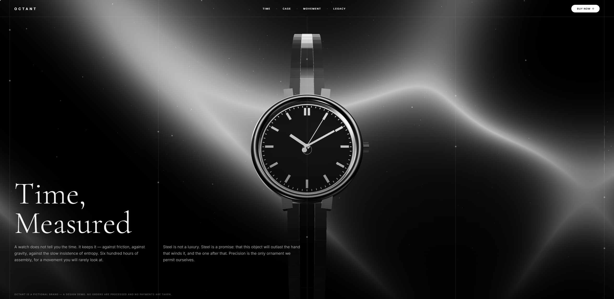
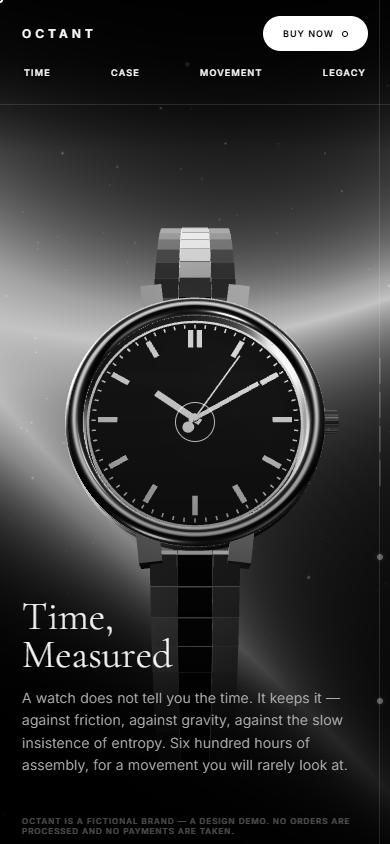

# OCTANT — Time, Measured

A scroll-driven WebGL landing page for **OCTANT**, a fictional watch brand.

**Live:** https://octantwatch.xyz

## What it is

A single self-contained `index.html`. No build step, no framework, no bundler, and — apart from
Three.js on a CDN and two Google fonts — no external assets at all. The watch is not a downloaded
3D model: it is built in code from primitives.

Scrolling the page turns the watch through one full revolution: dial → profile → exhibition
caseback → dial. The hands advance as you scroll (twelve hours over the full page), the second hand
sweeps in real time, and the balance wheel oscillates whether you scroll or not.

## How the watch is made

Everything is procedural Three.js geometry:

- **Case** — a closed `LatheGeometry` profile revolved into a steel ring, with a polished torus bezel.
- **Dial** — recessed disc, chapter ring, sixty minute ticks and twelve applied batons (doubled at twelve).
- **Hands** — geometry offset so each pivots about the dial centre; the seconds hand has a counterweight.
- **Bracelet** — links laid along a `CatmullRomCurve3` that wraps away from the viewer, each link a
  polished centre bar between two brushed flanks.
- **Movement** — visible through the sapphire caseback: four wheels, a balance wheel and a
  skeletonised oscillating weight.
- **Environment** — a studio softbox reflection map generated on a `<canvas>` and run through
  `PMREMGenerator`. Without it, metal at `metalness: 0.95` on a black stage has nothing to reflect
  and renders as a black hole.

The background is a three-layer sine-wave shader whose palette migrates by luminance — graphite at
the top of the page, polished steel at the bottom. The page is monochrome throughout.

## On a phone

The layout collapses to a single column below 820px, which also catches a portrait tablet. On a
portrait screen the camera aims at the middle of the case so the watch sits dead centre and the copy
runs beneath it. Touch devices lose the custom cursor, the shadow maps and half the dust particles —
they are the expensive part, and none of them survive contact with a phone GPU.

The bracelet is a closed loop rather than two open straps. An open bracelet has to end somewhere, and
because it curves away from the camera that end falls back inside the frame at most angles, reading
as a snapped strap. A loop has no ends.

## Running it

Open `index.html` in a browser. That is the whole procedure.

## Disclaimer

OCTANT is not a real company. The brand, the references, the calibre and the prices are invented for
a design exercise. The order form has no backend: it sends nothing, charges nothing, and no watch
will arrive.
